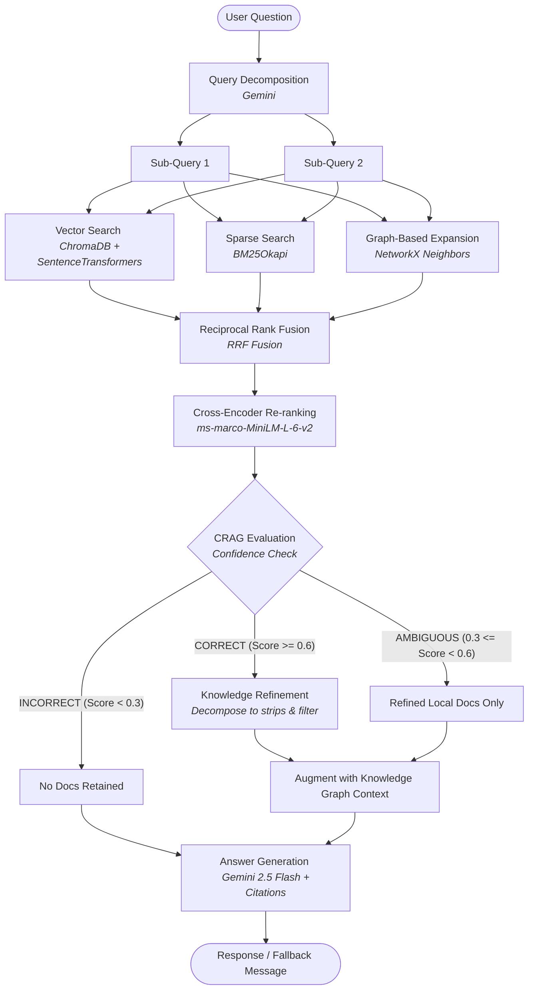

# F1 Historian 🏎️ — Corrective Retrieval-Augmented Generation (CRAG) Engine

A state-of-the-art Formula One Q&A assistant featuring a **Corrective Retrieval-Augmented Generation (CRAG)** pipeline. This project implements hybrid retrieval (Dense Vector + Sparse Keyword + Knowledge Graph) fused via **Reciprocal Rank Fusion (RRF)**, re-ranked with a **Cross-Encoder**, and routing queries dynamically based on retrieval confidence. When local documentation is insufficient, it avoids web search fallbacks and gracefully responds with a standard localized fallback message.

---

## 🏗️ Architecture & Pipeline Flow

The F1 Historian Q&A engine operates using the following advanced workflow:



---

## 🌟 Key Features

* **Custom Semantic Chunking:** Splits text at natural meaning boundaries (using sentence embeddings & cosine similarity thresholds) rather than cutting mid-sentence or mid-word, preserving contextual cohesion.
* **Hybrid Retrieval Engine:** 
  * **Dense Retrieval:** ChromaDB vector index embedded with `all-MiniLM-L6-v2`.
  * **Sparse Retrieval:** BM25Okapi index matching specific F1 terms, driver names, and dates.
  * **Knowledge Graph Retrieval:** Traverses 1-hop relationships in a NetworkX graph (drivers, teams, championships, rivalries) to pull structural contextual facts.
* **Reciprocal Rank Fusion (RRF):** Fuses candidates retrieved from vector, BM25, and graph searches to produce a balanced candidate pool.
* **Cross-Encoder Re-ranking:** Re-scores and re-orders candidates using the `ms-marco-MiniLM-L-6-v2` cross-encoder for high-fidelity ranking.
* **Fallback Response Handling:**
  * When local knowledge confidence is evaluated as `INCORRECT` (insufficient search matches) or the prompt context is inadequate to answer, the model responds with: `"I am sorry, I don't have enough information in the indexed documents."`
* **Automated Data Ingestion:**
  * A parser (`wiki_txt_parser.py`) converts Wikipedia-style text outputs into structured JSON.
  * Auto-tags entities (drivers, teams) using predefined canonical maps.
  * Extracts season-ranges from parsed text to enable automatic temporal filtering.

---

## 📂 Project Directory Structure

```
f1_rag_backend/
├── config.py                  # Environment loader, paths, thresholds, and entity maps
├── chunking.py                # Semantic chunker using cosine similarity of sentence embeddings
├── wiki_txt_parser.py         # Parser for scraped Wikipedia text documents (strips references, tags entities)
├── ingest.py                  # Main indexing pipeline (Vector store, BM25, Graph)
├── graph_utils.py             # NetworkX knowledge graph helper utilities
├── retriever.py               # Hybrid retriever fusing Vector, BM25, and Graph with RRF
├── crag_chain.py              # CRAG Pipeline: Decomposition, Reranking, CRAG Routing, Gemini Generation
├── api.py                     # FastAPI web server serving the /query endpoint
├── cli.py                     # Interactive terminal utility for debugging queries
├── requirements.txt           # Python dependencies
├── .env.example               # Example env file (requires GEMINI_API_KEY)
└── data/
    ├── raw_articles/          # Raw text or JSON documents (driver biographies, circuit details, etc.)
    ├── chroma/                # Compiled Chroma DB vector database files (generated)
    ├── bm25_index.pkl         # Compiled BM25 index (generated)
    └── graph/                 # NetworkX F1 Knowledge Graph pickle files (generated)
```

---

## 🚀 Setup & Execution

### 1. Installation & Environment Setup
Clone the repository and set up a virtual environment:
```bash
python -m venv venv
# On Windows:
venv\Scripts\activate
# On macOS/Linux:
source venv/bin/activate

pip install -r requirements.txt
python -m spacy download en_core_web_sm
```

Configure your environment variables:
```bash
cp .env.example .env
# Open .env and add your GEMINI_API_KEY
```

### 2. Run Data Ingestion
Place your raw `.txt` or `.json` articles into `data/raw_articles/` (see `data/raw_articles/example_ayrton_senna.json` for schema), then build the indexes:
```bash
python ingest.py
```
This compile step generates the Chroma collection, BM25 indices, and the NetworkX knowledge graph.

### 3. Run the CLI Interactive Mode
Test your retriever and generator directly from your terminal:
```bash
python cli.py "How did the Senna and Prost rivalry affect McLaren in 1989?"
```
Or start an interactive terminal chat:
```bash
python cli.py
```

### 4. Run the API Server
Start the FastAPI server to expose endpoints for frontend integrations:
```bash
python api.py
```
By default, the server runs on `http://localhost:8000`. You can check the health status via:
```bash
curl http://localhost:8000/health
```

### 5. Frontend Integration
Open `f1_historian_frontend.html` directly in your browser. Configure the endpoint setting to point to `http://localhost:8000/query` and begin exploring.

---

## 🛠️ Technology Stack

* **Framework:** [FastAPI](https://fastapi.tiangolo.com/) (Backend APIs)
* **LLM Engine:** [Gemini API](https://ai.google.dev/) (via `google-genai` SDK)
* **Vector Store:** [ChromaDB](https://www.trychroma.com/)
* **Keyword Matching:** BM25 (via `rank_bm25`)
* **Knowledge Graph:** [NetworkX](https://networkx.org/)
* **Embeddings & Re-ranking:** Hugging Face [SentenceTransformers](https://sbert.net/) (`all-MiniLM-L6-v2` & `cross-encoder/ms-marco-MiniLM-L-6-v2`)
* **Natural Language Processing:** [spaCy](https://spacy.io/) (`en_core_web_sm`)
